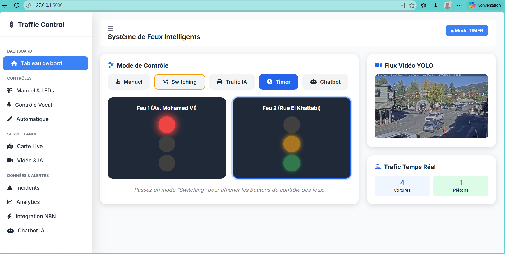
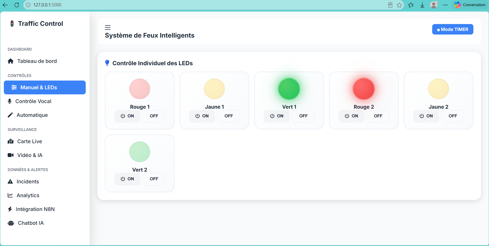
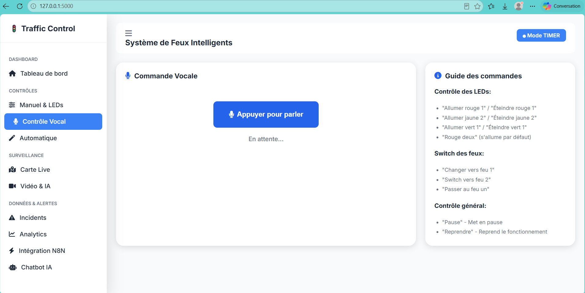
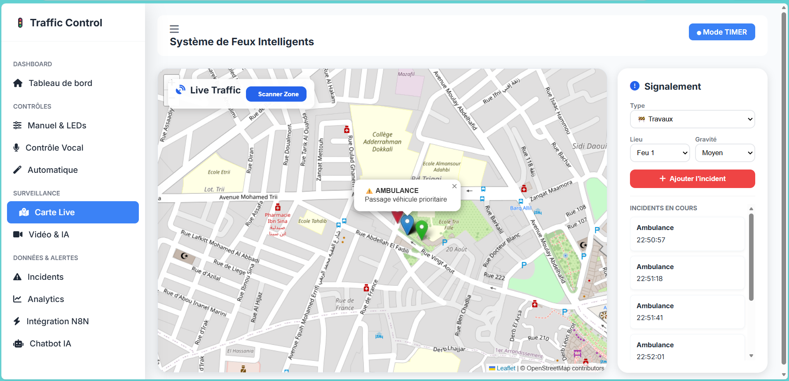
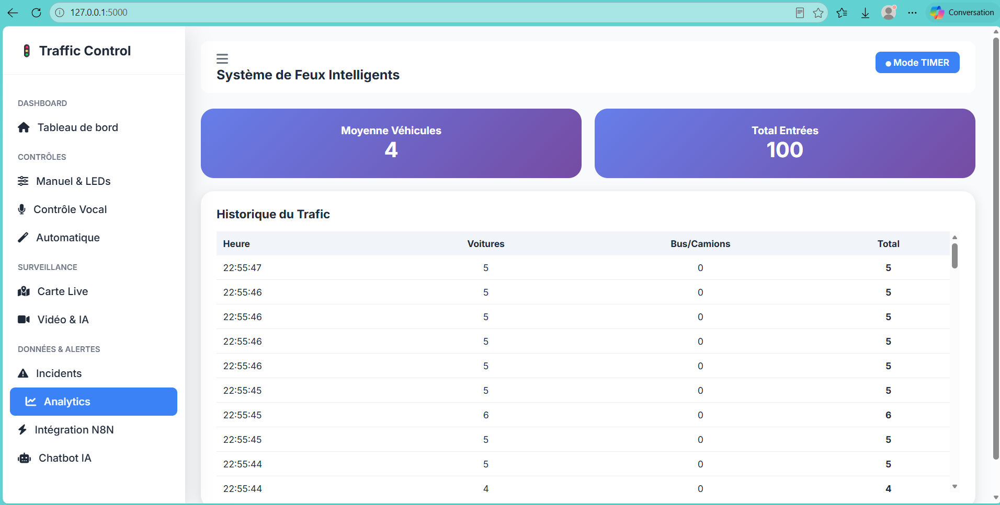
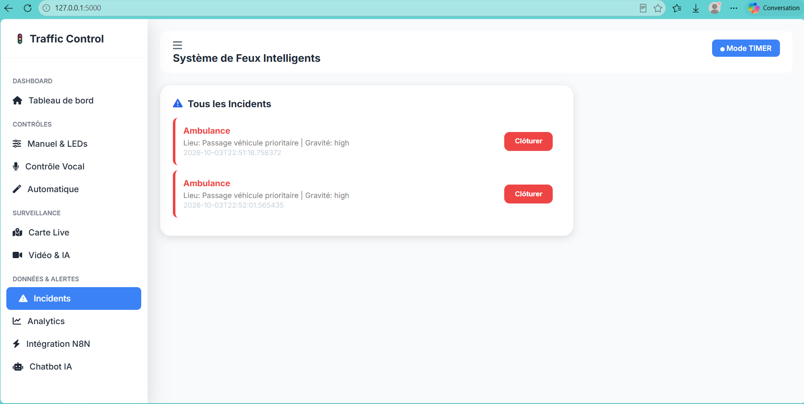
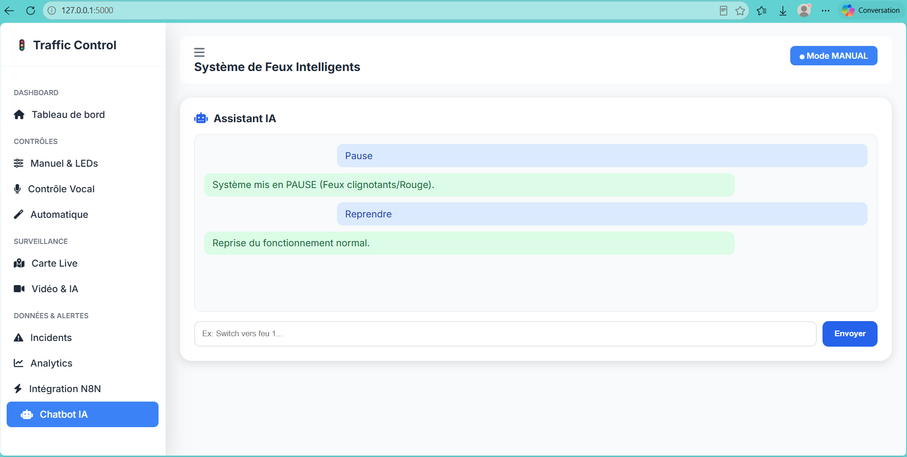
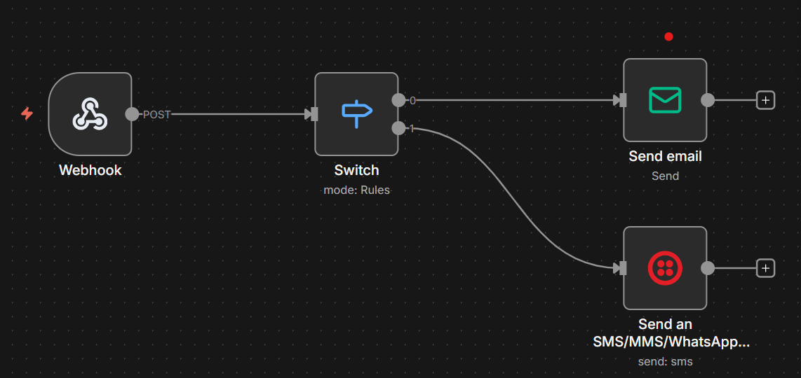

# 🚦 Smart City — Système de Feu Rouge Intelligent

## 🤖 Système intelligent de gestion et de supervision des feux de circulation

**Smart City** est un système intelligent de gestion et de supervision des feux de circulation combinant **Intelligence Artificielle, Vision par Ordinateur, IoT, contrôle vocal, chatbot IA, automatisation des workflows et services de communication**.

Le système permet de contrôler les feux de circulation à distance, de détecter et analyser le trafic en temps réel avec **YOLO**, de gérer les incidents et de synchroniser le contrôle logiciel avec un dispositif physique basé sur **ESP8266 et LEDs**.

---

# ✨ Fonctionnalités

## 🚦 Contrôle intelligent des feux

* 🔴 Contrôle des feux de circulation
* 🎮 Contrôle manuel
* 🎤 Commandes vocales en français
* ⏱️ Gestion automatique par timer
* 🤖 Adaptation du fonctionnement selon le trafic détecté
* 🔌 Contrôle physique des LEDs via ESP8266

## 🤖 Intelligence artificielle

* Détection des véhicules avec **YOLO**
* Analyse du trafic en temps réel
* Détection de différentes catégories :

  * 🚗 Voitures
  * 🚌 Bus
  * 🚛 Camions
  * 🚶 Piétons
* Comptage et statistiques du trafic
* Assistant conversationnel basé sur **DeepSeek**
* Exécution locale du modèle avec **Ollama**

## 📹 Surveillance vidéo

* Flux vidéo en temps réel
* Détection YOLO directement sur le flux
* Support d'une source vidéo YouTube
* Support d'une vidéo locale pour les tests
* Traitement vidéo avec OpenCV

## ⚠️ Gestion des incidents

* Création et suivi des incidents
* Gestion de différents types :

  * 🚧 Travaux routiers
  * 🚨 Accidents
  * 🚗 Embouteillages
* Localisation des incidents
* Notifications automatiques
* Intégration avec les services d'automatisation

## 📱 Communication avec Twilio

Le système intègre **Twilio** pour les fonctionnalités de communication et de notification liées aux événements et incidents.

Les informations sensibles de Twilio sont configurées à travers des variables d'environnement et ne sont pas incluses dans le dépôt.

## 🔗 Automatisation avec N8N

* Webhooks automatiques
* Notifications selon les événements
* Intégration avec :

  * 📧 Email
  * 💬 Slack
  * 🗄️ Base de données
* Workflows personnalisables
* Déclenchement d'actions selon les événements du système

## 🗺️ Cartographie

* Intégration de Google Maps
* Localisation des incidents
* Visualisation des informations liées au trafic
* Visualisation de l'état des feux

---

# 🏗️ Architecture du système

```text
                         ┌──────────────────────┐
                         │     Interface Web    │
                         │    HTML / CSS / JS   │
                         └──────────┬───────────┘
                                    │
                                    ▼
                         ┌──────────────────────┐
                         │     Backend Flask    │
                         │      server2.py      │
                         └───────┬──────┬───────┘
                                 │      │
                    ┌────────────┘      └──────────────┐
                    ▼                                  ▼
          ┌──────────────────┐              ┌──────────────────┐
          │    YOLO/OpenCV   │              │  Ollama/DeepSeek │
          │ Détection trafic │              │    Chatbot IA    │
          └────────┬─────────┘              └──────────────────┘
                   │
                   ▼
          ┌──────────────────┐
          │     ESP8266      │
          │   Contrôle LEDs  │
          └────────┬─────────┘
                   │
                   ▼
          ┌──────────────────┐
          │  🔴 🟡 🟢 Feux   │
          └──────────────────┘

          ┌──────────────────┐
          │       N8N        │
          │   Automatisation │
          └────────┬─────────┘
                   │
          ┌────────┴─────────┐
          ▼                  ▼
    ┌─────────────┐    ┌─────────────┐
    │   Twilio    │    │    Google   │
    │Communication│    │    Maps API │
    └─────────────┘    └─────────────┘
```

---

# 📁 Structure du projet

```text
Smart-City-Intelligent-Traffic-Light/
│
├── README.md
│
├── backend&frontend/
│   │
│   ├── templates/
│   │   └── index.html
│   │
│   ├── docs/
│   │   ├── API_DOCUMENTATION.md
│   │   ├── INSTALLATION.md
│   │   └── N8N_WORKFLOWS.md
│   │
│   ├── chatbot_feu.py
│   ├── package.json
│   ├── requirements.txt
│   ├── server.py
│   └── server2.py
│
├── arduino/
│   └── feu_rouge_esp8266.ino
│
└── screenshots/
    ├── dashboard.png
    ├── controle_manuel.png
    ├── controle_vocal.png
    ├── detection_yolo.png
    ├── statistiques.png
    ├── incidents.png
    ├── chatbot.png
    └── n8n_workflow.png
```

## 📄 Fichiers principaux

| Fichier / Dossier      | Description                          |
| ---------------------- | ------------------------------------ |
| `server2.py`           | ⭐ Serveur principal de l'application |
| `server.py`            | Serveur/backend complémentaire       |
| `chatbot_feu.py`       | Gestion du chatbot                   |
| `templates/index.html` | Interface web                        |
| `requirements.txt`     | Dépendances Python                   |
| `package.json`         | Configuration complémentaire         |
| `arduino/`             | Programme ESP8266                    |
| `screenshots/`         | Captures d'écran du projet           |
| `docs/`                | Documentation technique              |

---

# 🛠️ Technologies utilisées

## Backend

* Python
* Flask
* Flask-CORS
* OpenCV
* NumPy
* Ultralytics YOLO
* yt-dlp
* Requests

## Intelligence artificielle

* YOLO
* Ollama
* DeepSeek

## Frontend

* HTML
* CSS
* JavaScript

## IoT

* ESP8266
* Arduino IDE
* LEDs

## Automatisation

* N8N
* Webhooks
* Notifications

## Communication

* Twilio

## Cartographie

* Google Maps API

---

# 🚀 Installation

## 1. Prérequis

Avant de lancer le projet, installer :

* Python 3.x
* Arduino IDE
* ESP8266
* Ollama
* N8N
* Un navigateur web moderne

---

## 2. Cloner le projet

```bash
git clone https://github.com/Manal-Elagri/Smart-City-Intelligent-Traffic-Light.git
cd Smart-City-Intelligent-Traffic-Light
```

---

## 3. Installer les dépendances Python

Les dépendances se trouvent dans :

```text
backend&frontend/requirements.txt
```

Installer les dépendances avec :

```powershell
pip install -r "backend&frontend/requirements.txt"
```

Les principales bibliothèques utilisées sont :

```text
Flask
Flask-CORS
OpenCV
NumPy
Ultralytics
yt-dlp
Requests
```

---

# 🧠 Configuration d'Ollama et DeepSeek

Le chatbot utilise **Ollama** pour exécuter localement le modèle **DeepSeek**.

## Installer Ollama

Vérifier l'installation :

```bash
ollama --version
```

## Télécharger le modèle DeepSeek

```bash
ollama pull deepseek-r1:1.5b
```

Vérifier que le modèle est disponible :

```bash
ollama list
```

Le modèle suivant doit apparaître :

```text
deepseek-r1:1.5b
```

## Lancer Ollama

Si Ollama n'est pas déjà actif :

```bash
ollama serve
```

Le service Ollama utilise généralement :

```text
http://localhost:11434
```

---

# 📱 Configuration de Twilio

Le projet utilise **Twilio** pour les fonctionnalités de communication et de notification.

Les informations sensibles doivent être configurées localement.

Exemple de variables d'environnement :

```env
TWILIO_ACCOUNT_SID=your_account_sid
TWILIO_AUTH_TOKEN=your_auth_token
TWILIO_PHONE_NUMBER=your_twilio_number
```
---

# 🔌 Configuration ESP8266

Le projet utilise un **ESP8266** pour contrôler physiquement les LEDs représentant les différents états des feux.

Le code de l'ESP8266 se trouve dans :

```text
arduino/
```

## Préparation

1. Installer **Arduino IDE**.
2. Installer le support des cartes **ESP8266**.
3. Ouvrir le fichier `.ino` présent dans `arduino/`.
4. Configurer le réseau Wi-Fi dans le programme.
5. Sélectionner la carte ESP8266 utilisée.
6. Sélectionner le port série correspondant.
7. Téléverser le programme sur l'ESP8266.

## Configuration des LEDs

Les LEDs représentent les états du feu :

```text
🔴 Rouge
🟡 Jaune
🟢 Vert
```

Les GPIO utilisés doivent correspondre à ceux définis dans le programme Arduino.

> Vérifiez les numéros de GPIO directement dans le fichier `.ino` avant de réaliser le câblage.

---

# 🗺️ Configuration Google Maps

Le projet utilise **Google Maps API** pour les fonctionnalités liées à la cartographie et à la localisation des incidents.

## Étapes générales

1. Créer un projet dans Google Cloud.
2. Activer les APIs Google Maps nécessaires.
3. Créer une clé API.
4. Configurer les restrictions de la clé.
5. Configurer la clé dans l'application.

Exemple :

```env
GOOGLE_MAPS_API_KEY=your_api_key
```

⚠️ **Ne publiez jamais une véritable clé Google Maps dans GitHub.**

---

# 🔗 Configuration N8N

N8N permet d'automatiser les actions et les notifications du système.

## Lancer N8N

```bash
npx n8n
```

## Exemple de workflow

```text
Webhook
   │
   ├── Filter ──────► Slack
   │
   ├── Filter ──────► Email
   │
   └── Transform ───► Database
```

Les workflows détaillés sont disponibles dans :

```text
backend&frontend/docs/N8N_WORKFLOWS.md
```

---

# 🚦 Lancement de l'application

Le fichier principal utilisé pour lancer le système est :

```text
backend&frontend/server2.py
```

Depuis la racine du projet :

```powershell
python "backend&frontend/server2.py"
```

Lorsque le serveur démarre correctement, le dashboard est accessible à :

```text
http://localhost:5000
```

---

# 📡 API

## État et contrôle

| Méthode | Endpoint        | Description                |
| ------- | --------------- | -------------------------- |
| GET     | `/api/status`   | État global du système     |
| POST    | `/api/set_mode` | Changer le mode            |
| POST    | `/api/switch`   | Contrôler les feux         |
| POST    | `/api/pause`    | Mettre le système en pause |
| POST    | `/api/resume`   | Reprendre le système       |

## Incidents

| Méthode | Endpoint         | Description                       |
| ------- | ---------------- | --------------------------------- |
| GET     | `/api/incidents` | Récupérer les incidents           |
| POST    | `/api/incidents` | Créer un incident                 |
| DELETE  | `/api/incidents` | Résoudre ou supprimer un incident |

## Analyse et trafic

| Méthode | Endpoint               | Description              |
| ------- | ---------------------- | ------------------------ |
| GET     | `/api/analytics`       | Statistiques analytiques |
| GET     | `/api/traffic-history` | Historique du trafic     |
| GET     | `/api/map`             | Données de la carte      |

## Flux vidéo

```text
GET /video_feed
```

Cette route fournit le flux vidéo traité par OpenCV et YOLO.

La documentation complète est disponible dans :

```text
backend&frontend/docs/API_DOCUMENTATION.md
```

---

# 🤖 Détection du trafic avec YOLO

Le système utilise YOLO pour analyser le trafic et détecter différents types de véhicules et de personnes.

Les paramètres de détection peuvent notamment inclure :

```python
DETECTION_CONFIDENCE = 0.3
PROCESS_EVERY_N_FRAMES = 3
```

Le traitement d'une frame sur trois permet de réduire la charge de calcul tout en maintenant une détection suffisamment fluide.

---

# 📹 Source vidéo

Le système peut utiliser une source vidéo YouTube pour la surveillance.

La récupération du flux est effectuée avec :

```text
yt-dlp
```

et le traitement vidéo avec :

```text
OpenCV
```

Une vidéo locale peut également être utilisée pour effectuer des tests.

Les fichiers vidéo de test ne sont pas inclus dans le dépôt GitHub afin de conserver un dépôt léger.

---

# 📊 Événements N8N

Le système peut générer différents événements :

| Événement           | Description              |
| ------------------- | ------------------------ |
| `high_traffic`      | Trafic important détecté |
| `incident_created`  | Nouvel incident          |
| `incident_resolved` | Incident résolu          |
| `mode_changed`      | Changement de mode       |
| `light_switch`      | Changement de feu        |
| `traffic_paused`    | Système mis en pause     |
| `traffic_resumed`   | Reprise du système       |

Ces événements peuvent être utilisés par N8N pour déclencher différentes actions automatisées.

---

# 🎨 Interface

Le dashboard regroupe plusieurs modules :

1. 🏠 **Dashboard** — Vue générale
2. 🚦 **Contrôle manuel** — Gestion des feux
3. 🎤 **Contrôle vocal** — Commandes vocales
4. 🤖 **Contrôle automatique** — Timer et trafic
5. 📹 **Flux vidéo** — Détection YOLO
6. 📊 **Statistiques** — Analyse du trafic
7. ⚠️ **Incidents** — Gestion des incidents
8. 📈 **Analytics** — Historique et tendances
9. 🔗 **N8N** — Automatisation
10. 💬 **Chatbot** — Assistant IA

---

# 📸 Captures d'écran

Les principales interfaces du projet sont disponibles dans :

```text
screenshots/
```

### Dashboard



### Contrôle des feux (Manuel)



### Contrôle vocal



### Carte Live



### Statistiques



### Gestion des incidents



### Chatbot



### Workflow N8N



---

# 📱 Responsive Design

L'interface est conçue pour fonctionner sur :

* 💻 Desktop
* 📱 Tablette
* 📱 Mobile

---

# 📚 Documentation

La documentation complémentaire est organisée dans :

```text
backend&frontend/docs/
```

Elle comprend :

* **API_DOCUMENTATION.md** — Documentation des endpoints API
* **INSTALLATION.md** — Guide d'installation détaillé
* **N8N_WORKFLOWS.md** — Configuration et exemples des workflows N8N

---

# 🚀 Perspectives d'évolution

Le projet peut évoluer vers une solution de gestion intelligente de plusieurs intersections.

Les améliorations possibles comprennent :

* Prédiction de la congestion du trafic
* Adaptation dynamique de la durée des feux
* Détection automatique des véhicules prioritaires
* Intégration de nouveaux capteurs IoT
* Analyse statistique avancée du trafic
* Historisation des données
* Gestion de plusieurs intersections
* Déploiement sur une infrastructure cloud
* Amélioration des modèles de Computer Vision
* Communication entre plusieurs intersections intelligentes

---

# 🎓 Contexte du projet

Ce projet a été réalisé dans le cadre d'un projet académique en
Intelligence Artificielle et Informatique.

Ce projet combine plusieurs domaines technologiques :

**Intelligence Artificielle · Vision par ordinateur · IoT · ESP8266 · Automatisation · Développement Web · Communication intelligente**

Il constitue une démonstration pratique de l'intégration de technologies modernes dans une solution orientée **Smart City** pour améliorer la gestion et la supervision de la circulation urbaine.

---

# 👩‍💻 Auteur

**Manal Elagri**

*Ingénieure en Intelligence Artificielle & Informatique*

Projet réalisé dans un cadre académique.

---

# 📄 Licence

Ce projet est distribué sous licence **MIT**.

---

<p align="center">
  🚦 <strong>Smart City — Intelligent Traffic Management</strong>
</p>
